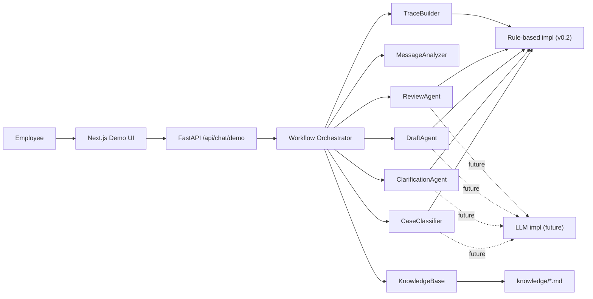

# 社内申請ナビゲーター

社内申請ナビゲーターは、日本企業の申請相談を `agent workflow` で整理する公開デモ向け PoC です。  
`expense` `purchase` `business_trip` の 3 類型を対象に、分類・補問・参照ルール・レビュー結果を trace として可視化します。  
rule-based backend を起点にしながら、将来の LLM 実装へ差し替えやすいインターフェースも `v0.2` で追加しました。

> English summary: A public-facing PoC for internal workflow support in Japanese companies. The system demonstrates why agent-style orchestration works better than a single chat response for application support: classification, policy retrieval, follow-up questions, draft generation, compliance review, and auditable trace output.

## これは何か

日本企業の社内申請では、規程が複数箇所に分散し、誰に確認すべきかが見えづらく、申請ドラフトの作成にも時間がかかります。  
このリポジトリは、その課題を「1 回の回答を返すチャットボット」ではなく、`役割分担された agent workflow` として小さく実装したデモです。

本 PoC で重視しているのは、全自動化ではなく次の 3 点です。

- 自然言語の相談から、申請類型を整理できること
- 不足情報を補問し、申請ドラフトと承認候補を返せること
- なぜその結果になったかを trace としてレビューできること

## なぜ通常のチャットボットではなく agent workflow なのか

通常のチャットボットは、単発の自然言語応答には向いていても、`分類 → 必須情報の補問 → 規程参照 → ドラフト生成 → コンプライアンス確認` のような段階的業務処理を一つの応答に押し込みがちです。  
このプロジェクトでは、処理を agent ごとに分けることで、業務フローの説明責任と差し替え容易性を優先しています。

- `Intake Agent`: 相談内容を 3 類型へ分類
- `Policy Retrieval Agent`: 参照すべき規程・テンプレート・承認ルールを取得
- `Clarification Agent`: 不足項目を補問へ変換
- `Draft Generation Agent`: 申請草稿、添付、承認ルート候補を生成
- `Review / Compliance Agent`: 規程リスクと人手確認ポイントを抽出
- `Logging / Ops Agent`: trace を監査可能な形式で残す

この分割により、`rule-based 実装` と `将来の LLM 実装` の境界が明確になり、GitHub 上でも設計意図を追いやすくなります。

## 固定の代表ユースケース

README で固定表示する代表シナリオは次の 3 件です。

1. [在宅勤務用モニターの購入申請](examples/scenarios.md#scenario-monitor-purchase)
2. [領収書不足の会食費精算](examples/scenarios.md#scenario-expense-receipt-gap)
3. [概算費用が未記載の出張申請](examples/scenarios.md#scenario-business-trip-estimate-gap)

## 対象スコープ

- `expense`: 経費申請
- `purchase`: 備品購入申請
- `business_trip`: 出張申請

知識ソースは実データではなく、`knowledge/` 配下の Markdown を使います。

- 類型別ポリシー
- 申請テンプレート
- 共通承認ルール
- 運用ガイド

## アーキテクチャ図



より詳しい説明は [docs/architecture.md](docs/architecture.md) を参照してください。

## デモで見えること

- 分類結果とその根拠キーワード
- 不足項目と補問候補
- 参照したドキュメントと適用ルール
- 申請草稿、必要添付、承認ルート候補
- レビュー結果と人手確認ポイント
- タイムライン付きの agent trace

## スクリーンショット


## ディレクトリ構成

```text
.
|-- backend/                 FastAPI と workflow orchestration
|   `-- app/                 agent interface / rule-based 実装 / API
|-- frontend/                Next.js デモ UI
|-- knowledge/               類型別ポリシー、テンプレート、共通ルール
|-- docs/                    アーキテクチャ、インターフェース、将来拡張メモ
|-- examples/                README から参照するデモシナリオ
|-- LICENSE                  OSS ライセンス
|-- CONTRIBUTING.md          コントリビューションガイド
|-- AGENTS.md                人間と coding agent 向けの作業ガイド
`-- .env.example             最小の環境変数サンプル
```

## 主要インターフェース

- `UserRequest`: 自然言語の相談入力
- `CaseType`: `expense` `purchase` `business_trip`
- `ClarificationItem`: 不足情報を確認する質問
- `DraftResult`: 草稿、添付、承認候補、注意点
- `ReviewResult`: 規程リスクと人手確認ポイント
- `PipelineTrace`: 分類、補問、参照ルール、レビュー結果、タイムライン

詳細は [docs/interfaces.md](docs/interfaces.md) を参照してください。

## backend の差し替えポイント

`v0.2` では backend に次の抽象インターフェースを追加しました。

- `CaseClassifier`
- `MessageAnalyzer`
- `ClarificationAgent`
- `DraftAgent`
- `ReviewAgent`
- `TraceBuilder`

現在は `backend/app/pipeline.py` 内の rule-based 実装がデフォルトですが、将来的には同じインターフェースを満たす LLM 実装へ順次置き換えられます。  
未対応範囲は [docs/future-work.md](docs/future-work.md) に整理しています。

## セットアップ

### Frontend

```bash
cd frontend
npm install
```

### Backend

```bash
cd backend
python3 -m venv .venv
source .venv/bin/activate
pip install -e .
```

環境変数は `.env.example` を参照してください。  
`NEXT_PUBLIC_API_BASE_URL` を未設定の場合、frontend は `http://127.0.0.1:8000` を使います。

## ローカル起動手順

1. バックエンドを起動する

```bash
cd backend
source .venv/bin/activate
uvicorn app.main:app --reload --host 127.0.0.1 --port 8000
```

2. 別ターミナルでフロントエンドを起動する

```bash
cd frontend
npm run dev -- --hostname 127.0.0.1 --port 3000
```

3. ブラウザで `http://127.0.0.1:3000` を開く

## 実行例

```bash
curl -X POST http://127.0.0.1:8000/api/chat/demo \
  -H "Content-Type: application/json" \
  -d '{"message":"大阪へ 2 日間の出張申請を出したいです。目的は顧客訪問です"}'
```

返却例の要点:

- `caseType`: `business_trip`
- `clarificationItems`: 概算費用や移動手段の不足
- `trace.ruleReferences`: 参照ドキュメントと適用ルール
- `trace.review`: 規程リスクと人手確認ポイント

## 制約事項

- `v0.2` はサンプル規程と軽量な rule-based ロジックを使った PoC であり、正式な社内規程や承認ワークフローそのものではありません
- PDF、社内 Wiki、メール本文、SSO、申請システム連携は未実装です
- 複数案件を 1 メッセージで同時に解釈する高度な自然言語理解には未対応です
- 生成結果は提出用の最終版ではなく、人の確認を前提にした下書きです

## Roadmap

- `v0.3`: PDF / Wiki 取り込みとナレッジ更新フローの追加
- `v0.4`: 承認経路を外部マスタ参照へ拡張
- `v0.5`: LLM 実装の追加と offline evaluation の整備
- `v0.6+`: 監査ログ、権限制御、申請システム連携の PoC

## 開発と検証

### Frontend

```bash
cd frontend
npm run build
```

### Backend

```bash
cd backend
python3 -m unittest
```

## 関連ドキュメント

- [examples/scenarios.md](examples/scenarios.md)
- [docs/architecture.md](docs/architecture.md)
- [docs/interfaces.md](docs/interfaces.md)
- [docs/development-process.md](docs/development-process.md)
- [docs/future-work.md](docs/future-work.md)
- [docs/release-checklist.md](docs/release-checklist.md)

## 参考資料

一次情報のみを採用しています。

- [OpenAI Codex](https://openai.com/codex/)
- [OpenAI: Introducing Codex](https://openai.com/index/introducing-codex/)
- [Anthropic: Building Effective AI Agents](https://www.anthropic.com/engineering/building-effective-agents)
- [IPA: DX動向2025](https://www.ipa.go.jp/digital/chousa/dx-trend/dx-trend-2025.html)
- [JIPDEC: 企業IT利活用動向調査2025](https://www.jipdec.or.jp/news/news/20250305.html)
