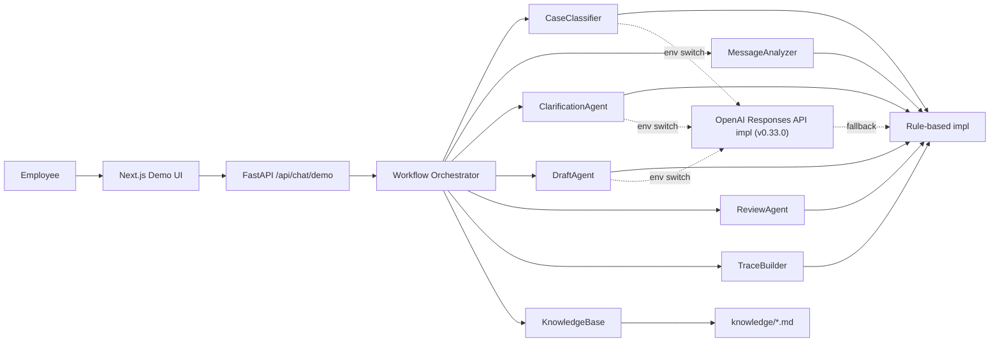
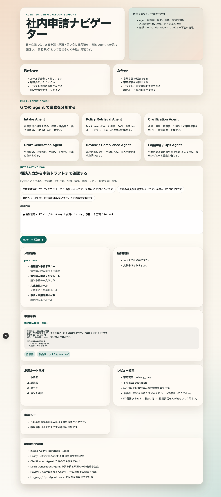
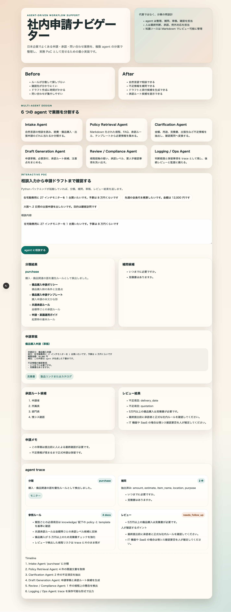
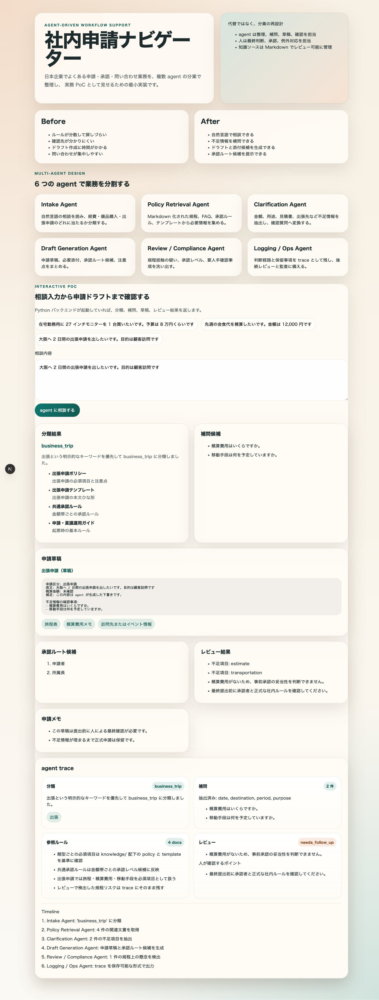

# 社内申請ナビゲーター

社内申請ナビゲーターは、日本企業の申請相談を `agent workflow` で整理する公開デモ向け PoC です。  
`expense` `purchase` `business_trip` の 3 類型を対象に、分類・補問・参照ルール・レビュー結果を trace として可視化します。  
`v0.33.0` では、rule-based PoC を維持したまま、OpenAI Responses API と Structured Outputs を使う LLM backend を hardening し、壊れた出力時の fallback と実 provider smoke test まで追加しました。

> English summary: A public-facing PoC for internal workflow support in Japanese companies. The system demonstrates why agent-style orchestration works better than a single chat response for application support: classification, policy retrieval, follow-up questions, draft generation, compliance review, and auditable trace output.

## これは何か

日本企業の社内申請では、規程が複数箇所に分散し、誰に確認すべきかが見えづらく、申請ドラフトの作成にも時間がかかります。  
このリポジトリは、その課題を「1 回の回答を返すチャットボット」ではなく、`役割分担された agent workflow` として小さく実装したデモです。

本 PoC で重視しているのは、全自動化ではなく次の 3 点です。

- 自然言語の相談から、申請類型を整理できること
- 不足情報を補問し、申請ドラフトと承認候補を返せること
- なぜその結果になったかを trace としてレビューできること

## なぜ通常のチャットボットではなく agent workflow なのか

通常のチャットボットは、単発の自然言語応答には向いていても、`分類 → 必須情報の補問 → 規程参照 → ドラフト生成 → コンプライアンス確認` のような段階的業務処理を一つの応答に押し込みがちです。  
このプロジェクトでは、処理を agent ごとに分けることで、業務フローの説明責任と差し替え容易性を優先しています。

- `Intake Agent`: 相談内容を 3 類型へ分類
- `Policy Retrieval Agent`: 参照すべき規程・テンプレート・承認ルールを取得
- `Clarification Agent`: 不足項目を補問へ変換
- `Draft Generation Agent`: 申請草稿、添付、承認ルート候補を生成
- `Review / Compliance Agent`: 規程リスクと人手確認ポイントを抽出
- `Logging / Ops Agent`: trace を監査可能な形式で残す

この分割により、`rule-based 実装` と `LLM 実装` の境界が明確になり、GitHub 上でも設計意図を追いやすくなります。

## 固定の代表ユースケース

README で固定表示する代表シナリオは次の 3 件です。

1. [在宅勤務用モニターの購入申請](examples/scenarios.md#scenario-monitor-purchase)
2. [領収書不足の会食費精算](examples/scenarios.md#scenario-expense-receipt-gap)
3. [概算費用が未記載の出張申請](examples/scenarios.md#scenario-business-trip-estimate-gap)

## 対象スコープ

- `expense`: 経費申請
- `purchase`: 備品購入申請
- `business_trip`: 出張申請

知識ソースは実データではなく、`knowledge/` 配下の Markdown を使います。

- 類型別ポリシー
- 申請テンプレート
- 共通承認ルール
- 運用ガイド

## アーキテクチャ図



より詳しい説明は [docs/architecture.md](docs/architecture.md) を参照してください。

## デモで見えること

- 分類結果とその根拠キーワード
- 不足項目と補問候補
- 参照したドキュメントと適用ルール
- 申請草稿、必要添付、承認ルート候補
- レビュー結果と人手確認ポイント
- タイムライン付きの agent trace

## スクリーンショット







## ディレクトリ構成

```text
.
|-- backend/                 FastAPI と workflow orchestration
|   `-- app/                 agent interface / rule-based 実装 / API
|-- frontend/                Next.js デモ UI
|-- knowledge/               類型別ポリシー、テンプレート、共通ルール
|-- docs/                    アーキテクチャ、インターフェース、将来拡張メモ
|-- examples/                README から参照するデモシナリオ
|-- LICENSE                  OSS ライセンス
|-- CONTRIBUTING.md          コントリビューションガイド
|-- AGENTS.md                人間と coding agent 向けの作業ガイド
`-- .env.example             最小の環境変数サンプル
```

## 主要インターフェース

- `UserRequest`: 自然言語の相談入力
- `CaseType`: `expense` `purchase` `business_trip`
- `ClarificationItem`: 不足情報を確認する質問
- `DraftResult`: 草稿、添付、承認候補、注意点
- `ReviewResult`: 規程リスクと人手確認ポイント
- `PipelineTrace`: 分類、補問、参照ルール、レビュー結果、タイムライン

詳細は [docs/interfaces.md](docs/interfaces.md) を参照してください。

## backend の差し替えポイント

`backend/app/agent_interfaces.py` を起点に、次の抽象インターフェースで責務を分離しています。

- `CaseClassifier`
- `MessageAnalyzer`
- `ClarificationAgent`
- `DraftAgent`
- `ReviewAgent`
- `TraceBuilder`

`v0.33.0` 時点では次の構成です。

- `rule_based`: すべてのステージを rule-based 実装で処理
- `llm`: `CaseClassifier` `ClarificationAgent` `DraftAgent` を OpenAI Responses API 実装へ切り替え
- LLM 各 agent は Structured Outputs の JSON Schema 検証を通し、失敗時は agent 単位で rule-based fallback する
- `MessageAnalyzer` `ReviewAgent` `TraceBuilder` は、現時点では rule-based のまま残して説明可能性を維持

未対応範囲は [docs/future-work.md](docs/future-work.md) に整理しています。

## セットアップ

### Frontend

```bash
cd frontend
npm install
```

### Backend

```bash
cd backend
python3 -m venv .venv
source .venv/bin/activate
pip install -e .
```

環境変数は `.env.example` を参照してください。  
`NEXT_PUBLIC_API_BASE_URL` を未設定の場合、frontend は `http://127.0.0.1:8000` を使います。

`v0.33.0` で整理した主な backend 環境変数:

- `SHINSEI_WORKFLOW_BACKEND`: `rule_based` または `llm`
- `SHINSEI_LLM_PROVIDER`: 現在は `openai`
- `SHINSEI_LLM_MODEL`: 利用するモデル名。既定値は `gpt-5.4-mini`
- `SHINSEI_LLM_BASE_URL`: 既定は OpenAI API。必要時のみ上書き
- `SHINSEI_LLM_API_KEY`: OpenAI API key
- `SHINSEI_LLM_TIMEOUT_SECONDS`: OpenAI Responses API 呼び出し timeout
- `SHINSEI_LLM_RETRIES`: retry 回数
- `SHINSEI_LLM_TEMPERATURE`: 生成温度
- `SHINSEI_LLM_MAX_OUTPUT_TOKENS`: Structured Outputs を含む応答の上限トークン

`OPENAI_API_KEY` も `SHINSEI_LLM_API_KEY` の代替として利用できます。

## ローカル起動手順

1. バックエンドを起動する

```bash
cd backend
source .venv/bin/activate
uvicorn app.main:app --reload --host 127.0.0.1 --port 8000
```

2. 別ターミナルでフロントエンドを起動する

```bash
cd frontend
npm run dev -- --hostname 127.0.0.1 --port 3000
```

3. ブラウザで `http://127.0.0.1:3000` を開く

LLM backend を試す場合は、backend 起動前に次のように設定します。

```bash
export SHINSEI_WORKFLOW_BACKEND=llm
export SHINSEI_LLM_PROVIDER=openai
export SHINSEI_LLM_MODEL=gpt-5.4-mini
export SHINSEI_LLM_API_KEY=...
```

UI の `agent trace` 先頭には、`Workflow Runtime: rule_based` または `Workflow Runtime: llm (...)` が表示されます。  
LLM agent が失敗した場合は、`CaseClassifier: ... rule-based fallback を使用しました。` のように agent ごとの理由が timeline に残ります。

## 実行例

```bash
curl -X POST http://127.0.0.1:8000/api/chat/demo \
  -H "Content-Type: application/json" \
  -d '{"message":"大阪へ 2 日間の出張申請を出したいです。目的は顧客訪問です"}'
```

返却例の要点:

- `caseType`: `business_trip`
- `clarificationItems`: 概算費用や移動手段の不足
- `trace.ruleReferences`: 参照ドキュメントと適用ルール
- `trace.review`: 規程リスクと人手確認ポイント

## v0.33.0 の hardening

### rule-based backend

- 既存の keyword / heuristic / amount rule を使って安定的に処理
- テストしやすく、外部依存なしで再現可能
- ただし、表現ゆれや曖昧な相談文への追従には限界がある

### LLM backend

- `CaseClassifier` `ClarificationAgent` `DraftAgent` を OpenAI Responses API で実装
- `text.format` に JSON Schema を渡す Structured Outputs で、enum / required fields / additionalProperties を検証
- `knowledge/` の Markdown を一次ソースとして prompt に渡す
- 同じ orchestrator と trace 構造を維持しつつ、分類理由と草稿を自然言語で柔軟に返せる

### Responses API を使う理由

- OpenAI の最新モデルは Responses API と Client SDKs から利用する前提で整理されている
- 単一 endpoint で stateful / agentic な拡張へつなげやすい
- このリポジトリでは Assistants API ではなく Responses API を前提に固定することで、運用方針を明確にした

### Structured Outputs を使う理由

- JSON mode より一段強く schema adherence を期待できる
- `CaseClassifier` の case type enum や `ClarificationAgent` の required fields を壊れにくくできる
- 出力が schema を満たさない場合、agent 単位で rule-based fallback できる

### rule-based fallback の意味

- OpenAI API key がない
- OpenAI Responses API が一時失敗する
- LLM 応答が JSON / schema validation を満たさない

この 3 パターンでも全 workflow を止めず、影響した agent だけ rule-based に戻して trace に理由を残します。

### まだ rule-based のまま残している部分

- `MessageAnalyzer`: 金額や日付表現の軽量抽出
- `ReviewAgent`: 最低限の規程リスク検出
- `TraceBuilder`: UI の説明責任を崩さない trace 生成

## 簡易 eval

`v0.2` の代表シナリオ 3 件に対して、簡易 eval を追加しています。  
これは本格的なモデル品質評価ではなく、`workflow regression を早く検知するための最低限のゲート` です。

確認する観点:

- シナリオごとの期待分類
- 補問が必要かどうか
- 草稿に最低限含まれるべき語句
- レビュー結果に最低限含まれるべき不足項目や規程リスク
- 失敗時にどの agent で崩れたか
- LLM backend では fallback や success を trace から追えること

実行コマンド:

```bash
cd backend
python3 -m app.evals --backend all
```

`--backend rule_based` `--backend llm` も指定できます。  
`llm` は API key がない環境では skip されます。

## 制約事項

- `v0.33.0` はサンプル規程と最小の agent workflow を使った PoC であり、正式な社内規程や承認ワークフローそのものではありません
- LLM backend は分類・補問・草稿生成のみを対象にした hardening であり、レビューや長期会話制御まではまだ含みません
- 現在の provider 実装は OpenAI Responses API を正式対応した最小構成で、provider 多様化は未対応です
- API key がない環境で `SHINSEI_WORKFLOW_BACKEND=llm` を指定すると、各 agent は trace に理由を残して rule-based fallback します
- 実 provider の検証は smoke test レベルで、長時間運用や負荷試験、cost 管理までは未実施です
- PDF、社内 Wiki、メール本文、SSO、申請システム連携は未実装です
- 複数案件を 1 メッセージで同時に解釈する高度な自然言語理解には未対応です
- 生成結果は提出用の最終版ではなく、人の確認を前提にした下書きです

## Roadmap

- `v0.4`: knowledge retrieval の強化と RAG 的な根拠参照の追加
- `v0.5`: 承認経路やレビューを外部マスタ / 実システム連携前提で拡張
- `v0.6+`: 監査ログ、権限制御、申請システム連携、継続評価の整備

## 開発と検証

### Frontend

```bash
cd frontend
npm run build
```

### Backend

```bash
cd backend
python3 -m unittest
python3 -m app.evals --backend all
```

## 関連ドキュメント

- [examples/scenarios.md](examples/scenarios.md)
- [docs/architecture.md](docs/architecture.md)
- [docs/interfaces.md](docs/interfaces.md)
- [docs/development-process.md](docs/development-process.md)
- [docs/future-work.md](docs/future-work.md)
- [docs/release-checklist.md](docs/release-checklist.md)

## 参考資料

一次情報のみを採用しています。

- [OpenAI API: GPT-5.2-Codex](https://developers.openai.com/api/docs/models/gpt-5.2-codex)
- [OpenAI API: codex-mini-latest](https://developers.openai.com/api/docs/models/codex-mini-latest)
- [Anthropic: Building Effective AI Agents](https://www.anthropic.com/engineering/building-effective-agents)
- [IPA: DX動向2025](https://www.ipa.go.jp/digital/chousa/dx-trend/dx-trend-2025.html)
- [JIPDEC: 企業IT利活用動向調査2025](https://www.jipdec.or.jp/news/news/20250305.html)
