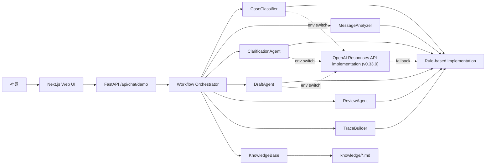

# アーキテクチャ概要

## 目的

`社内申請ナビゲーター` は、社内申請に関する自然言語相談を受け取り、複数 agent の役割分担で申請支援結果を返す PoC です。  
`v0.33.0` では、公開デモとして理解しやすいことに加えて、rule-based 実装を残したまま、分類・補問・草稿生成を OpenAI Responses API + Structured Outputs 実装へ hardening しました。

## システム構成

## コンポーネント

### Frontend

- Next.js による単一ページの相談 UI
- 分類結果、補問候補、申請草稿、承認経路、レビュー結果を表示
- `v0.33` では classification / clarification / rule references / review に加えて、実行 backend を timeline 先頭で可視化

### Backend

- `InternalApplicationNavigator` が workflow orchestration を担当
- 各ステージは抽象インターフェース経由で差し替え可能
- `SHINSEI_WORKFLOW_BACKEND=rule_based` では全ステージを rule-based で実行
- `SHINSEI_WORKFLOW_BACKEND=llm` では `CaseClassifier` `ClarificationAgent` `DraftAgent` を OpenAI Responses API 実装へ切り替える
- OpenAI 側の出力は Structured Outputs の JSON Schema で検証する
- 出力が壊れた場合や API key がない場合は agent 単位で rule-based fallback する
- `MessageAnalyzer` `ReviewAgent` `TraceBuilder` は、現時点では説明可能性を優先して rule-based を維持

### Knowledge

- Markdown ベースの規程、FAQ、承認ルール、テンプレート
- 類型別文書と共通ルールを分離
- LLM backend でも `knowledge/` の Markdown を prompt の一次ソースとして利用
- 将来は PDF 抽出結果や外部ナレッジベースを追加予定

## 差し替えポイント

`backend/app/agent_interfaces.py` で定義している主な差し替えポイントは次の通りです。

- `CaseClassifier`
- `MessageAnalyzer`
- `ClarificationAgent`
- `DraftAgent`
- `ReviewAgent`
- `TraceBuilder`

rule-based 実装は `backend/app/pipeline.py`、OpenAI Responses API 実装は `backend/app/llm_agents.py` にあります。  
runtime の切り替えは `backend/app/runtime.py` が担当します。

## データフロー

1. UI が自然言語メッセージを送る
2. `CaseClassifier` が申請類型を判定する
3. `KnowledgeBase` が関連文書を取得する
4. `ClarificationAgent` が不足項目を抽出する
5. `DraftAgent` が草稿と必要添付を作る
6. `ReviewAgent` が規程抵触や要確認事項を返す
7. `TraceBuilder` が判断過程をレビュー可能な trace として残す
8. trace の timeline 先頭に、実行 backend (`rule_based` / `llm`) を残す
9. LLM backend では、各 agent の success / fallback 理由を timeline に残す

## 設計上の前提

- `v0.33.0` は実データ非対応
- 対象業務は `expense` `purchase` `business_trip` のみ
- 生成結果は提案であり、最終判断は人が行う
- 承認ルートはサンプル規程に基づく候補表示であり、正式ワークフロー連携は未実装
- LLM provider 実装は OpenAI Responses API を正式対応した最小構成
