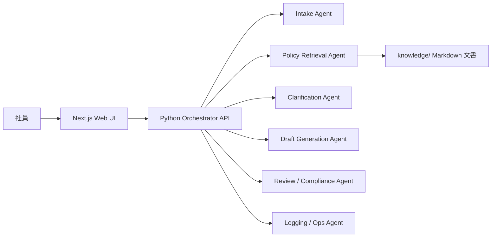

# アーキテクチャ概要

## 目的

`社内申請ナビゲーター` は、社内申請に関する自然言語相談を受け取り、複数 agent の役割分担で申請支援結果を返す PoC です。

## システム構成

## コンポーネント

### Frontend

- 単一ページの相談 UI
- 入力文、補問候補、申請草稿、承認経路、注意点を表示
- 将来的には会話履歴、承認フロー可視化、添付管理へ拡張

### Backend

- 自然言語入力からケース分類、ルール参照、補問、ドラフト生成、レビューを直列で実行
- ルールエンジンは v0.1 ではシンプルな Python ロジックで表現
- 監査性を担保するために trace をレスポンスへ含める

### Knowledge

- Markdown ベースの規程、FAQ、承認ルール、テンプレート
- 類型別文書と共通 FAQ を分離
- 将来は PDF 抽出結果や外部ナレッジベースを追加予定

## データフロー

1. UI が自然言語メッセージを送る
2. Intake Agent が申請類型を判定する
3. Policy Retrieval Agent が関連文書とルールを引く
4. Clarification Agent が不足項目を抽出する
5. Draft Generation Agent が草稿と必要添付を作る
6. Review / Compliance Agent が規程抵触や要確認事項を返す
7. Logging / Ops Agent が判断過程を trace として残す

## 設計上の前提

- v0.1 は実データ非対応
- 対象業務は `expense` `purchase` `business_trip` のみ
- 生成結果は提案であり、最終判断は人が行う
- 承認ルートはサンプル規程に基づく候補表示であり、正式ワークフロー連携は未実装

